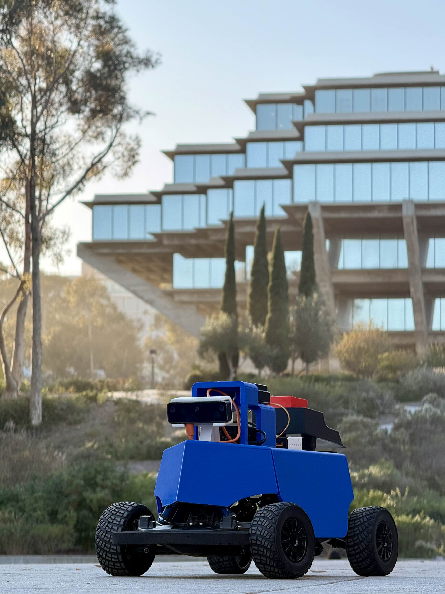
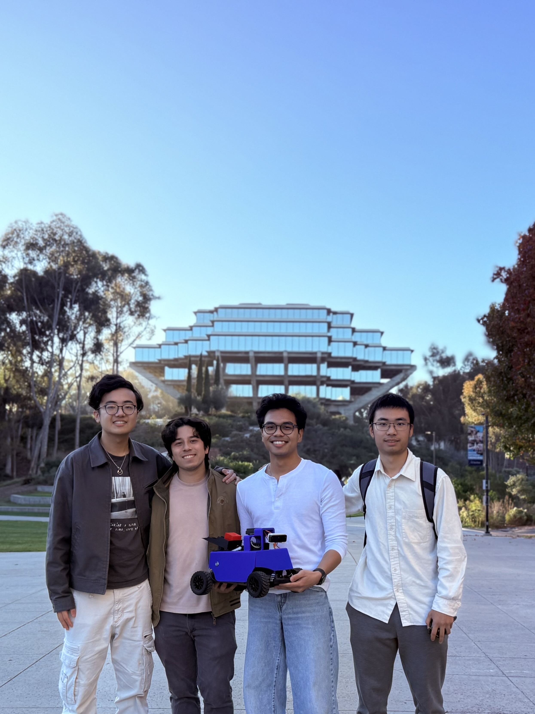

<div align="center">

# Autonomous Mail Delivery

</div>

<p align="center">
  
</p>

---

<div align="center">
  
### ECE/MAE 148 Final Project
### Team 14 - Fall 2025
<p align="center">
    </p>
*Special thanks to the teaching team for their support.*
</div>

<details>
  <summary><h1>Table of Contents<h1></summary>
  <ol>
    <li><a href="#overview">Overview</a></li>
      <ul>
        <li><a href="#youtube-videos">YouTube Videos</a></li>
        <li><a href="#key-features">Key Features</a></li>
      </ul>
    </li>
    <li><a href="#team-members">Team Members</a></li>
    <li><a href="#project-goals">Project Goals</a>
      <ul>
        <li><a href="#core-objectives">Core Objectives</a></li>
      </ul>
    </li>
        <li><a href="#ros2-node-descriptions">ROS2 Node Descriptions</a>
      </ul>
    </li>
    <li><a href="#technologies-used">Technologies Used</a></li>
    <li><a href="#how-to-run">How to Run</a>
      <ul>
        <li><a href="#prerequisites">Prerequisites</a></li>
        <li><a href="#steps">Steps</a></li>
      </ul>
    </li>
    <li><a href="#robot-design">Robot Design</a>
      <ul>
        <li><a href="#cad-parts">Car Parts</a></li>
        <li><a href="#software">Software</a></li>
      </ul>
    </li>
    <li><a href="#acknowledgments">Acknowledgments</a></li>
  </ol>
</details>

## Overview

This project focuses on developing an autonomous delivery system capable of identifying a target container, navigating towards it, and depositing a payload using a specialized dumping mechanism. 

The system utilizes a **Finite State Machine (FSM)** to manage a multi-stage mission: searching for a target using YOLOv8, aligning with the target using front-facing AprilTags, performing a complex 180-degree turn, reversing into a parking spot using a rear-facing webcam, and finally actuating a servo to drop the package.

To ensure computational efficiency, the system implements a **Node Activation Logic**, where the central controller dynamically toggles perception and control nodes ON or OFF depending on the current mission phase (e.g., disabling the front camera neural network while reversing).

<!--  -->

### Video:

[](https://www.youtube.com/watch?v=VivayishKWo)

**Note:** Setup of parts (such as camera position, compute power, and car configuration) can vary from car to car, and tuning may be required to achieve the same effect.

### **Key Features**
- **Dual-Camera Perception:** Utilizes an OAK-D camera for front-facing Neural Network inference and a USB webcam for rear-facing precision alignment.
- **YOLOv8 Object Detection:** Custom trained model (`yolov8_n.blob`) to identify delivery containers from a distance.
- **Precision Reverse Parking:** Uses `pupil_apriltags` to calculate pose and distance, allowing the car to back into the delivery zone accurately.
- **Dynamic Resource Management:** A custom node activation protocol that saves CPU/GPU resources by disabling unused sensors during specific mission states.
- **Servo-Actuated Delivery:** Automated control of a dump-bed mechanism to release the package upon successful parking.

---

## Team Members


<p align="center">
    
</p>

| Name              | Major                      | Class       | Links |
|-------------------|----------------------------|-------------|-------|
| Kazuya Miyata  | Computer Science    | Class of 2027 | [Linkedin](https://www.linkedin.com/in/kazmiyata/) |
| Najmi Mohammad Hanis   | Mechanical Engineering       | Class of 2027 | [Linkedin](https://www.linkedin.com/in/najmi-hanis/) |
| Yuan Xu  | Mechanical Engineering     | Class of 2027 | [Linkedin](https://www.linkedin.com/in/zack-xu-513509207/) |
| Daniel Ryan Scuba  | Mechanical Engineering     | Class of 2026 | [Linkedin](https://www.linkedin.com/in/daniel-scuba-/) |

---

## **Project Goals**

### **Core Objectives**
1. **Target Acquisition:**
   - Implement YOLOv8 on the OAK-D to recognize the specific delivery box among obstacles.
   - Transition to AprilTag detection for precise distance estimation.

2. **Complex Maneuvers:**
   - Execute a logic-based 180-degree turn when in proximity to the target.
   - Implement a "Backup Park" controller that utilizes rear-camera feedback to steer the car backwards into the drop zone.

3. **Autonomous Delivery:**
   - Successfully actuate the servo mechanism to drop the package only when the car is fully stopped and aligned.

### **Nice-to-Have Features**
- **Headless Mode:** Configurable visualization settings to run the robot without a GUI for maximum performance.
- **Obstacle Avoidance:** Integration with LiDAR to avoid dynamic obstacles during the search phase.

---

### **ROS2 Node Descriptions**

The system architecture relies on a central controller managing several specialized nodes:

1. The ```mission_controller```
    - The "Brain" of the robot. It implements the Finite State Machine (FSM).
    - Phases managed: `SEARCH`, `ALIGN_FRONT`, `TURN_AROUND`, `BACKUP_PARK`, `DROP_PACKAGE`.
    - Publishes to `/node_control` to toggle other nodes ON/OFF to save resources.

2. The ```oak_perception_node```
    - Interfaces with the OAK-D Lite camera.
    - Runs the custom YOLOv8 Neural Network to detect the bounding box of the delivery container.
    - Publishes detection data used during the `SEARCH` phase.

3. The ```apriltag_node``` (Front)
    - Processes the RGB stream from the front camera.
    - Calculates the exact pose (x, y, z, yaw) of the target relative to the car.
    - Used for the `ALIGN_FRONT` phase to center the car before turning.

4. The ```webcam_apriltag``` (Rear)
    - Interfaces with the rear-mounted USB webcam.
    - Activates only during the `TURN_AROUND` and `BACKUP_PARK` phases.
    - Provides critical feedback for reversing into the delivery spot.

5. The ```servo_controller```
    - Listens for the drop command from the mission controller.
    - Actuates the servo to tilt the bed and release the package.

---

## **Technologies Used**
- **ROS2 (Foxy/Humble):** The underlying middleware for node communication.
- **DepthAI:** Pipeline for running Neural Networks on the OAK-D camera.
- **YOLOv8:** Object detection model trained for container recognition.
- **Pupil AprilTags:** Library for robust fiducial marker detection.
- **Docker:** Used to containerize the development environment for the PI.

---

## **How to Run**

### **Prerequisites**
- PI 5 with UCSD Robocar Docker image installed.
- **Dependencies:** `depthai>=2.28.0.0` and `pupil-apriltags`.
- Calibrated VESC and steering servos.

### **Steps**
1. **Clone the Repository:**
   Inside the Docker container:
   ```bash
   cd src
   git clone [https://github.com/](https://github.com/)[YOUR_USERNAME]/ros2_delivery_bot.git
   ```

2. **Install Python Dependencies:**
```bash
pip install -r src/ros2_delivery_bot/requirements.txt

```


3. **Configure the Hub:**
Add the package to the `node_config.yaml` in the UCSD Robocar Hub to ensure it launches correctly with the nav system.
4. **Build the Workspace:**
```bash
source_ros2
colcon build --packages-select auto_delivery_pkg

```


5. **Launch the Mission:**
You can launch the standalone mission or the full integrated system:
```bash
source_ros2
ros2 launch auto_delivery_pkg mission.launch.py

```


---

## Robot Design
### Car Parts
| Custom Designed Parts | Description | Preview | Designer |
|--------|-------------|---------|---------|
| Base Plate | A base plate with universal mounting holes, designed for easy components mounting and wiring.|  |Najmi|
| Right Shell | Right panel of the car shell, with a hole for the power button switch. |  |Najmi|
| Left Shell | Left panel of the car shell. |  |Najmi|
| Front Bumper| A front bumper shaped around functional-industrial aesthetic. |  |Najmi|
| Sensor Platform | A structural platform for GPS antenna and LiDAR that prioritizes clean planes, softened edges, and mounting flexibility. |  |Najmi|
| Shell Assembly | Overall assembly of the outer shell. |  |Najmi|
| Camera Mount Base | Mounting base for the Oak-d camera. |  |Daniel|
| Camera Mount | Rotatable camera mount for the Oak-d camera. |  |Daniel|
| Servo Bracket | Mounting bracket for the MG996R Servo. |  |Daniel|
| Servo Horn | Servo horn to raise and lower the package dump mechanism. |  |Daniel|
| Package Dump Base | Mounting base for the package dump mechanism. |  |Daniel|
| Package Dump | Dump mechanism used for package delivery. |  |Daniel|


#### Wiring Diagram
<p align="center">
    
</p>

 <!-- TODO HERE  -->

### Software
#### Embedded Systems
The system runs on an Pi 5. To manage the high load of running ROS2 alongside Computer Vision (CV) pipelines, we implemented a **Node Activation Flow**. This ensures that the heavy YOLO model is only active during the search phase, and the rear camera processing is only active during parking, keeping CPU usage within stable limits. We also implemented the AI-hat, to offload some of the april-tag processing workload.

#### Neural Network
We trained a custom YOLOv8 Nano model on a dataset of our specific delivery boxes. This model was compiled into a `.blob` file to run natively on the OAK-D's Myriad X VPU, offloading processing from the PI's main CPU.

## Acknowledgments
*Thanks to Professor Jack Silberman and the TAs for their guidance on the UCSD Robocar framework. Special thanks to the creators of the `pupil_apriltags` library.*
